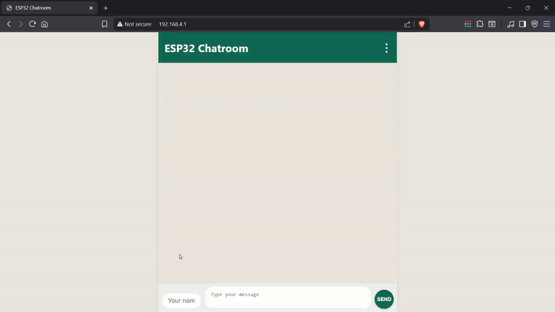

# 📡 ESP32 Wi-Fi Chatroom

Turn your ESP32 into a **local chat server** using its Wi-Fi Access Point (AP) capabilities. Multiple users can connect to the ESP32's network and chat in real-time through a modern, WhatsApp-style web interface.

---

## 🚀 Features

- 📶 **Self-hosted Wi-Fi AP** – No router or internet required
- 💬 **Live chatroom** – Auto-refreshes every 3 seconds
- 🧍‍♂️ **Username memory** – Remembers user name using `localStorage`
- ✨ **Modern UI** – WhatsApp-style, responsive & mobile-friendly
- 🧹 **Clear chat** – Admin-style option to wipe chat history
- 📱 **Optimized for mobile** – Touch-friendly interface
- 🔒 **Message sanitation** – Prevents special characters from breaking format

---

## 🛠️ Requirements

- ESP32 development board
- Arduino IDE with ESP32 board support
- Required libraries:
  - `WiFi.h`
  - `WebServer.h`
  - `esp_wifi.h`

---

## 📷 Demo

<!-- Optional: Add GIF or screenshot -->

---

## ⚙️ How It Works

1. ESP32 sets up a Wi-Fi Access Point (`ESP32-Chat`, password: `12345678`).
2. Hosts a chat web page on `192.168.4.1`.
3. Users can:
   - View chat messages (`/chat`)
   - Send messages (`/send`)
   - Clear chat (`/clear`)
4. Messages are stored in a `String chatLog` in memory.

---

## 💬 Usage

1. Upload the code to your ESP32 using Arduino IDE.
2. Connect your phone/laptop to Wi-Fi:  
   **SSID:** `ESP32-Chat`  
   **Password:** `12345678`
3. Open your browser and go to:  
   `http://192.168.4.1`
4. Chat away!

---

## 🧩 Customization Tips

- 🧠 **Memory Management:** Logs are trimmed when they exceed 2 KB.
- 🔋 **Heat/Power Save:** `esp_wifi_set_ps(WIFI_PS_MIN_MODEM);` reduces power draw.
- 🎨 **UI Styling:** Modify the embedded HTML (`MAIN_page`) for custom themes or features.

---

## ⚠️ Limitations

- Messages are not persistent (lost on reboot)
- Works only on local Wi-Fi AP (not internet-connected)
- Very basic spam/format validation

---

## 📃 License

This project is open-source under the [MIT License](LICENSE).

---

## 🙌 Credits

- UI inspired by WhatsApp Web
- Icons via [Font Awesome](https://cdnjs.com/)
- Developed using Arduino + ESP32

---

## ✨ Future Improvements

- [ ] Add message timestamps
- [ ] Store chat logs in EEPROM/SPIFFS
- [ ] Emoji/sticker support
- [ ] Show list of active users

---

Happy Building! 🔧💬
